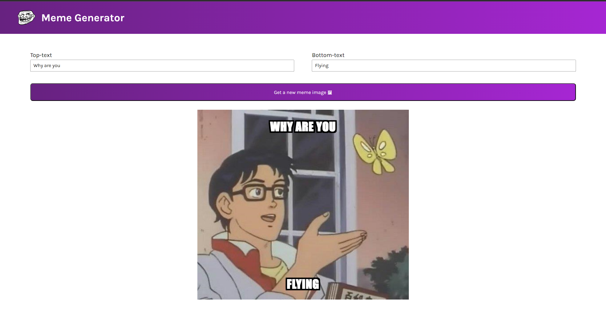

# Meme generator

This is a meme generation website with top and bottom texts.

## Description

A project from Scrimba(ReactJS course). Randomly select from 100 images to get a template for you meme and then add top and bottom texts to it dynamically.

## Installation

Use the package manager [npm](https://www.npmjs.com/) to install Meme genrator.

```bash
cd my-project
npm install
npm run build
npm start
```

## Getting started

This app was built with [React](https://react.dev/) and [Vite](https://vitejs.dev/)

## Built with

- HTML
- CSS
- ReactJS
- Vite

## Screenshot



## Links
Github - [https://github.com/bijitregmi/meme-generator](https://github.com/bijitregmi/meme-generator)
Netlify - [https://meme-generator-app-scrimba.netlify.app/](https://meme-generator-app-scrimba.netlify.app/)

## Learning process

- React hooks
- States
- Conditional rendering
- Form state management
- Api calls
- Side effects and memory management

## Acknowledgment

- [React](https://react.dev/) - Documentation for most implementations 
- [Stack overflow](https://stackoverflow.com/) - Css styling tips
- [Srcimba](https://scrimba.com/) - Project format and build ideas form the course